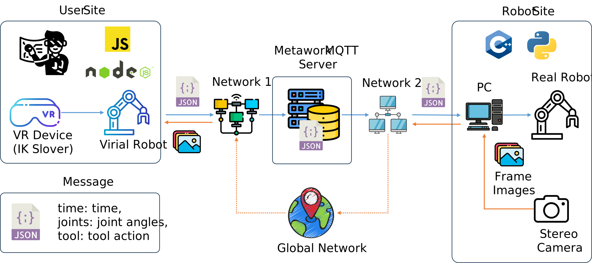

# MetaworkMQTT Protocol-Based PiPER Controller



## 🚀 Quick Start

### 🧩 Step 1: Run MQTT Controller (User Site)
```bash
cd ./src/app
npm run dev-https
```

💡 If this is your first time running the project, you need to install the required Node.js modules first:
```bash
cd ./src/app
npm install
```

🌐 After the server is running, you can access the VR Viewer in your browser by appending /viewer to the server address. For example:
```arduion
https://192.168.197.37:3000/viewer/
```
This interface is used to visualize and send VR controller data via MQTT.

📊 You can also access the status monitor via the following URL:
```arduion
https://sora2.uclab.jp/menroll
```
This page provides a real-time interface for observing user information.

###  🧩 Step 2: Run PiPER Controller (Robot Site)
Follow the steps below to control the **AgileX-PiPER** robot via MQTT:

1. **Activate the CAN bus**
   Execute the following command in your terminal:
   ```bash
   cd ./AgileX-PiPER-MetworkMQTT
   bash can_activate.sh can0 1000000
   ```

2. **Start the PiPER SDK UI**
   
   (check "agilex_pipier_connect.mkv" in the video folder )
   
   🌐 Download the PiPER SDK UI
   
   ```arduion
   https://github.com/agilexrobotics/Piper_sdk_ui.git
   ```

   Open the PiPER SDK Tools and perform the following operations:

      (1) Click Reset
      
      (2) Click Enable
      
      (3) Click Go Zero
      
   🔁 If the robot fails to go to the zero position, repeat this step a few times until successful.

3. **Set the robot to the working position**
   
   Run the following script:
   ```bash
   python piper_work_position_initialize.py
   ```

4. **Retrieve your USER_UUID from the Viewer**
   
   (check "mqtt_teleoperation_start.mp4" in the video folder )
   
   Open the Viewer in your browser:
   
   ```arduion
   https://<your-server-address>/viewer
   ```

   For example:
   ```arduion
   https://192.168.197.37:3000/viewer/
   ```
   
   Press F12 to open Developer Tools
   
   Look for the USER_UUID in the console or network tab and copy it to the "MQTT_Recv.py", Line 25
   
5. **Run the Robot Controller Script**

   Choose one of the following options depending on your control needs:

   - **PD Control + Trajectory Planning**  
     This is the most stable option, as both velocity and acceleration are smoothly planned.
     ```bash
     python MQTT_Robot_Feedback_PD_Traj.py
     ```

   - **PD Control**  
     Basic proportional-derivative control without trajectory planning.
     ```bash
     python MQTT_Robot_Feedback_PD.py
     ```

   - **Direct Control Signal**  
     Sends raw control signals directly to the robot without any feedback or planning.
     ```bash
     python MQTT_Robot_Control.py
     ```

## ⚠️ Notifications

1. **Keep the VR controller within camera view**  
   The pose of the VR controller is estimated using both the onboard **accelerometer** and the **tracking camera** located on the side of the VR headset.  
   > ⚠️ If the controller goes out of view, pose estimation may become inaccurate, resulting in input drift.

2. **Wait for system initialization**  
   After putting on the VR headset or restarting the system, **always wait until initialization is complete**.  
   > Skipping this step may result in control drift or unstable input.
   > ⚠️ If the controller appears frozen or unresponsive, it may indicate a tracking issue.
   > ✅ If you can see the controller moving in sync with your hand, it is functioning correctly.  

## 📚 Citations

The inverse kinematics (IK) implementation in this project is based on the **Modern Robotics** library by Kevin Lynch et al.

- 📘 Book: *Modern Robotics: Mechanics, Planning, and Control*  
- 💻 Source Code: [NxRLab/ModernRobotics GitHub Repository](https://github.com/NxRLab/ModernRobotics)

